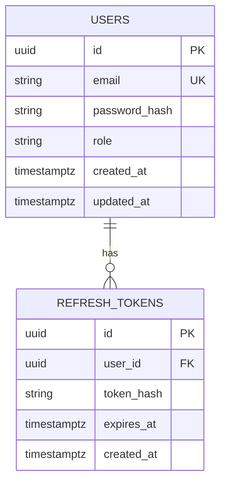

# Database Schema Documentation

## PostgreSQL 17.8

This document provides comprehensive database schema documentation for the Rust Backend Framework.

---

## Table of Contents

1. [Overview](#1-overview)
2. [Schema Diagram](#2-schema-diagram)
3. [Tables](#3-tables)
4. [Indexes](#4-indexes)
5. [Migrations](#5-migrations)
6. [ERD](#6-erd)
7. [Data Types](#7-data-types)
8. [Naming Conventions](#8-naming-conventions)

---

## 1. Overview

| Attribute | Value |
|-----------|-------|
| Database | PostgreSQL |
| Version | 17.8 |
| Encoding | UTF8 |
| Collation | en_US.UTF-8 |
| Primary Use | User authentication and management |

---

## 2. Schema Diagram

```
┌─────────────────┐       ┌─────────────────────┐
│     users       │       │   refresh_tokens    │
├─────────────────┤       ├─────────────────────┤
│ id (PK)         │◄──────│ user_id (FK)        │
│ email (UQ)      │       │ id (PK)             │
│ password_hash   │       │ token_hash          │
│ role            │       │ expires_at          │
│ created_at      │       │ created_at          │
│ updated_at      │       └─────────────────────┘
└─────────────────┘
```

---

## 3. Tables

### 3.1 Users Table

```sql
CREATE TABLE users (
    id UUID PRIMARY KEY DEFAULT gen_random_uuid(),
    email VARCHAR(255) UNIQUE NOT NULL,
    password_hash VARCHAR(255) NOT NULL,
    role VARCHAR(50) NOT NULL DEFAULT 'user',
    created_at TIMESTAMP WITH TIME ZONE DEFAULT CURRENT_TIMESTAMP,
    updated_at TIMESTAMP WITH TIME ZONE DEFAULT CURRENT_TIMESTAMP
);
```

#### Column Definitions

| Column | Type | Constraints | Description |
|--------|------|-------------|-------------|
| id | UUID | PRIMARY KEY | Unique user identifier, auto-generated |
| email | VARCHAR(255) | UNIQUE, NOT NULL | User email address |
| password_hash | VARCHAR(255) | NOT NULL | Argon2 hashed password |
| role | VARCHAR(50) | NOT NULL, DEFAULT 'user' | User role (admin/user/guest) |
| created_at | TIMESTAMP WITH TIME ZONE | DEFAULT NOW() | Creation timestamp |
| updated_at | TIMESTAMP WITH TIME ZONE | DEFAULT NOW() | Last update timestamp |

#### Role Values

| Role | Description | Permissions |
|------|-------------|-------------|
| admin | Administrator | Full system access |
| user | Standard user | Default access |
| guest | Guest user | Limited read-only access |

#### Example Data

| id | email | role | created_at |
|----|-------|------|------------|
| 550e8400-e29b-41d4-a716-446655440000 | admin@example.com | admin | 2026-03-11 00:00:00+00 |
| 660e8400-e29b-41d4-a716-446655440001 | user@example.com | user | 2026-03-11 00:00:00+00 |

---

### 3.2 Refresh Tokens Table

```sql
CREATE TABLE refresh_tokens (
    id UUID PRIMARY KEY DEFAULT gen_random_uuid(),
    user_id UUID NOT NULL REFERENCES users(id) ON DELETE CASCADE,
    token_hash VARCHAR(255) NOT NULL,
    expires_at TIMESTAMP WITH TIME ZONE NOT NULL,
    created_at TIMESTAMP WITH TIME ZONE DEFAULT CURRENT_TIMESTAMP
);
```

#### Column Definitions

| Column | Type | Constraints | Description |
|--------|------|-------------|-------------|
| id | UUID | PRIMARY KEY | Unique token identifier |
| user_id | UUID | FOREIGN KEY → users(id) | Associated user |
| token_hash | VARCHAR(255) | NOT NULL | SHA-256 hash of refresh token |
| expires_at | TIMESTAMP WITH TIME ZONE | NOT NULL | Token expiration timestamp |
| created_at | TIMESTAMP WITH TIME ZONE | DEFAULT NOW() | Creation timestamp |

#### Token Expiration

| Token Type | Expiry |
|------------|--------|
| Refresh Token | 7 days (604800 seconds) |

#### Example Data

| id | user_id | expires_at | created_at |
|----|---------|------------|------------|
| 770e8400-e29b-41d4-a716-446655440002 | 550e8400-e29b-41d4-a716-446655440000 | 2026-03-18 00:00:00+00 | 2026-03-11 00:00:00+00 |

---

## 4. Indexes

### 4.1 User Indexes

```sql
-- Email lookup index
CREATE INDEX idx_users_email ON users(email);

-- Role-based lookup
CREATE INDEX idx_users_role ON users(role);

-- Timestamp-based sorting
CREATE INDEX idx_users_created_at ON users(created_at DESC);
```

### 4.2 Refresh Token Indexes

```sql
-- User token lookup
CREATE INDEX idx_refresh_tokens_user_id ON refresh_tokens(user_id);

-- Expiration cleanup
CREATE INDEX idx_refresh_tokens_expires_at ON refresh_tokens(expires_at);

-- Token hash lookup
CREATE INDEX idx_refresh_tokens_token_hash ON refresh_tokens(token_hash);
```

---

## 5. Migrations

### 5.1 Initial Schema Migration

File: `migrations/001_initial_schema.sql`

```sql
-- Migration: 001_initial_schema
-- Description: Create initial database schema
-- Created: 2026-03-11

-- Create users table
CREATE TABLE users (
    id UUID PRIMARY KEY DEFAULT gen_random_uuid(),
    email VARCHAR(255) UNIQUE NOT NULL,
    password_hash VARCHAR(255) NOT NULL,
    role VARCHAR(50) NOT NULL DEFAULT 'user',
    created_at TIMESTAMP WITH TIME ZONE DEFAULT CURRENT_TIMESTAMP,
    updated_at TIMESTAMP WITH TIME ZONE DEFAULT CURRENT_TIMESTAMP
);

-- Create refresh_tokens table
CREATE TABLE refresh_tokens (
    id UUID PRIMARY KEY DEFAULT gen_random_uuid(),
    user_id UUID NOT NULL REFERENCES users(id) ON DELETE CASCADE,
    token_hash VARCHAR(255) NOT NULL,
    expires_at TIMESTAMP WITH TIME ZONE NOT NULL,
    created_at TIMESTAMP WITH TIME ZONE DEFAULT CURRENT_TIMESTAMP
);

-- Create indexes for users table
CREATE INDEX idx_users_email ON users(email);
CREATE INDEX idx_users_role ON users(role);
CREATE INDEX idx_users_created_at ON users(created_at DESC);

-- Create indexes for refresh_tokens table
CREATE INDEX idx_refresh_tokens_user_id ON refresh_tokens(user_id);
CREATE INDEX idx_refresh_tokens_expires_at ON refresh_tokens(expires_at);
CREATE INDEX idx_refresh_tokens_token_hash ON refresh_tokens(token_hash);
```

### 5.2 Migration Commands

```bash
# Run migrations
cargo sqlx migrate run

# Revert last migration
cargo sqlx migrate revert

# Create new migration
cargo sqlx migrate add <migration_name>
```

---

## 6. ERD

### 6.1 Entity Relationship Diagram



---

## 7. Data Types

### 7.1 PostgreSQL Data Types Used

| Type | Description | Example |
|------|-------------|---------|
| UUID | Universally Unique Identifier | 550e8400-e29b-41d4-a716-446655440000 |
| VARCHAR(n) | Variable-length string | "admin@example.com" |
| TIMESTAMP WITH TIME ZONE | DateTime with timezone | 2026-03-11T00:00:00Z |

### 7.2 UUID Generation

The database uses PostgreSQL's built-in UUID generation:

```sql
-- Auto-generate UUID
gen_random_uuid()

-- Example
SELECT gen_random_uuid();
-- Result: 550e8400-e29b-41d4-a716-446655440000
```

---

## 8. Naming Conventions

### 8.1 Table Names

| Convention | Example |
|-----------|---------|
| Plural, snake_case | users, refresh_tokens |

### 8.2 Column Names

| Convention | Example |
|------------|---------|
| Snake_case | user_id, created_at |
| Singular for foreign keys | user_id (not users_id) |

### 8.3 Index Names

| Convention | Example |
|------------|---------|
| idx_{table}_{column} | idx_users_email |
| uk_{table}_{column} (unique) | uk_users_email |

---

## 9. Security Considerations

### 9.1 Password Storage

- Passwords are hashed using **Argon2id**
- Salt is generated automatically by Argon2
- Hash is stored in `password_hash` column

### 9.2 Token Storage

- Refresh tokens are hashed using **SHA-256** before storage
- Only the hash is stored, never plaintext tokens
- Expired tokens are cleaned up automatically

### 9.3 Row-Level Security

```sql
-- Enable row-level security (future)
ALTER TABLE users ENABLE ROW LEVEL SECURITY;

-- Create policy (future)
CREATE POLICY users_select ON users
    FOR SELECT
    USING (auth.uid() = id OR auth.role() = 'admin');
```

---

## 10. Backup & Recovery

### 10.1 Backup Strategy

| Type | Frequency | Retention |
|------|-----------|-----------|
| Full Backup | Daily | 30 days |
| Incremental | Hourly | 7 days |
| WAL Archiving | Continuous | 30 days |

### 10.2 Point-in-Time Recovery

```bash
# Restore to specific timestamp
pg_restore -h localhost -U postgres -d app --target-time="2026-03-11 12:00:00" backup.dump
```

---

## 11. Performance Tuning

### 11.1 Connection Pooling

| Setting | Development | Production |
|---------|-------------|------------|
| Max Connections | 10 | 20 |
| Min Connections | 2 | 5 |
| Idle Timeout | 600s | 300s |
| Acquire Timeout | 30s | 10s |

### 11.2 Query Optimization

```sql
-- Analyze query performance
EXPLAIN ANALYZE 
SELECT * FROM users 
WHERE email = 'user@example.com';

-- Check index usage
SELECT 
    indexrelname,
    idx_scan,
    idx_tup_read,
    idx_tup_fetch
FROM pg_stat_user_indexes
WHERE relname = 'users';
```

---

## Appendix A: SQL Quick Reference

### User Operations

```sql
-- Create user
INSERT INTO users (email, password_hash, role)
VALUES ('user@example.com', '$argon2id$...', 'user');

-- Get user by email
SELECT * FROM users WHERE email = 'user@example.com';

-- Get user by ID
SELECT * FROM users WHERE id = '550e8400-e29b-41d4-a716-446655440000';

-- Update user
UPDATE users 
SET email = 'new@example.com', updated_at = NOW() 
WHERE id = '550e8400-e29b-41d4-a716-446655440000';

-- Delete user
DELETE FROM users WHERE id = '550e8400-e29b-41d4-a716-446655440000';
```

### Token Operations

```sql
-- Create refresh token
INSERT INTO refresh_tokens (user_id, token_hash, expires_at)
VALUES ('550e8400-e29b-41d4-a716-446655440000', 'sha256hash...', NOW() + INTERVAL '7 days');

-- Get valid tokens for user
SELECT * FROM refresh_tokens 
WHERE user_id = '550e8400-e29b-41d4-a716-446655440000' 
AND expires_at > NOW();

-- Cleanup expired tokens
DELETE FROM refresh_tokens WHERE expires_at < NOW();
```

---

## Appendix B: Troubleshooting

### Common Issues

| Issue | Solution |
|-------|----------|
| Slow queries | Check EXPLAIN ANALYZE, add indexes |
| Connection pool exhausted | Increase pool size, check for leaks |
| UUID generation failed | Enable pgcrypto extension |

---

**Database Version: PostgreSQL 17.8**

**Last Updated: 2026-03-11**
